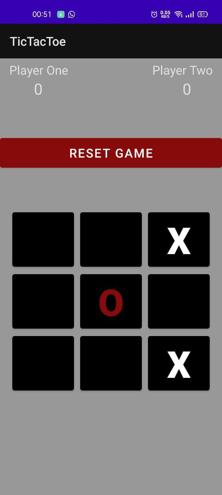

# TicTacToeKW
Source code of my android lab project==> Game Tic Tac Toe.

I don't deserve any credit for this project because, this code is originally comes from YouTube Channel CodeWithMazn [Awosome Channel for you who is still newbie in coding] 
Here is the link for the tutorial video: 
How to Make a Tic Tac Toe Game in Android [Java 2020]
https://www.youtube.com/watch?v=CCQTD7ptYqY&t=16s

This is some screenshoot of how the app run in android:

By Muhammad Irsyad (2019302029)
Pemograman Mobile (Android) Semester 4
